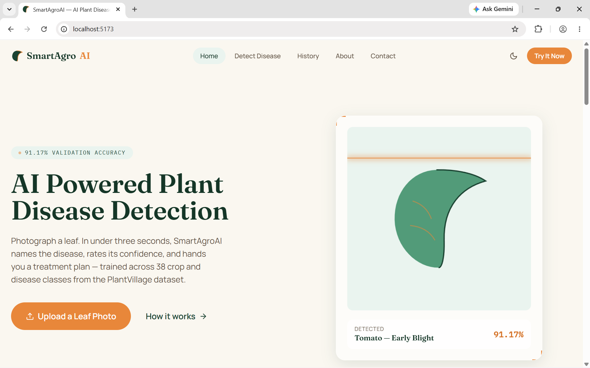
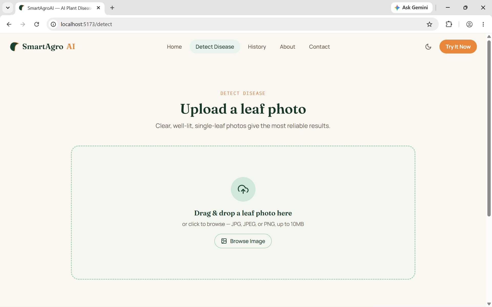
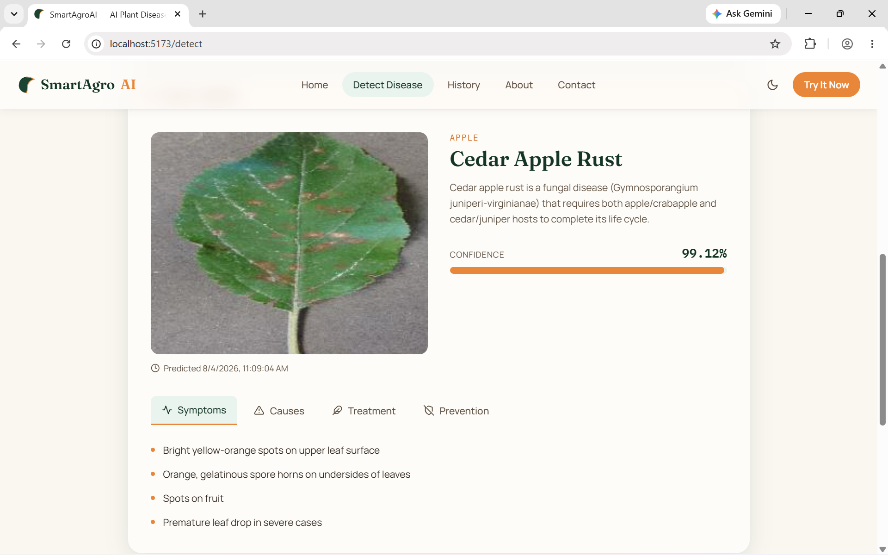
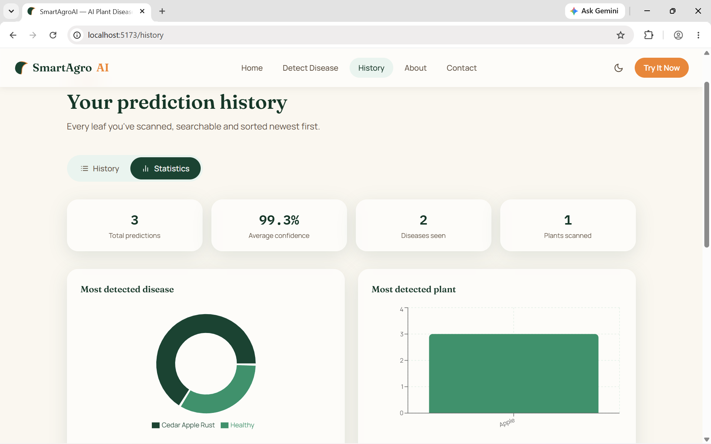

# 🌿 SmartAgroAI

**SmartAgroAI** is an AI-powered web application that detects plant diseases from leaf images using a trained Convolutional Neural Network (CNN). The system provides disease prediction, confidence score, detailed disease information, treatment suggestions, prevention tips, and prediction history through a modern React frontend and FastAPI backend.

---

## 🚀 Features

* 🌱 Upload a plant leaf image
* 🤖 AI-based disease detection using TensorFlow/Keras CNN
* 📊 Confidence score for each prediction
* 📖 Disease description
* 🩺 Symptoms and causes
* 💊 Treatment suggestions
* 🛡️ Prevention tips
* 🕒 Prediction history
* 📱 Responsive modern UI
* 🌙 Dark mode support

---

## 📸 Screenshots

### Home Page


### Disease Detection


### Prediction Result


### Prediction History


---

## 🧠 AI Model

* **Dataset:** PlantVillage
* **Classes:** 38 plant disease categories
* **Framework:** TensorFlow / Keras
* **Input Size:** 224 × 224 RGB
* **Best Validation Accuracy:** **91.17%**

The trained model is stored in:
```
backend/model/best_cnn.keras
backend/model/class_names.json
```

---

## 🛠️ Tech Stack

### Frontend
* React 19
* Vite
* Tailwind CSS
* React Router
* Axios
* Framer Motion
* Recharts
* React Icons
* React Hot Toast

### Backend
* FastAPI
* TensorFlow
* Pillow
* NumPy
* Pydantic
* Uvicorn

---

## 📂 Project Structure

```
SmartAgroAI/
├── backend/
│   ├── app/
│   ├── model/
│   │   ├── best_cnn.keras
│   │   └── class_names.json
│   ├── disease_data.json
│   ├── uploads/
│   ├── history/
│   ├── requirements.txt
│   └── main.py
│
├── frontend/
│   ├── src/
│   ├── public/
│   ├── .env.example
│   └── package.json
│
├── notebooks/
│   ├── 01_Dataset_Exploration.ipynb
│   ├── 02_Building_First_CNN.ipynb
│   └── 03_Improved_CNN.ipynb
│
├── dataset/ (ignored from Git)
├── .gitignore
└── README.md
```

---

## 🧪 Model Training Summary

The project was developed in three stages:

### 1. Initial CNN
* Basic convolution and pooling layers
* Training Accuracy: ~96%
* Validation Accuracy: ~57%
* Problem: **Overfitting**

### 2. Improved CNN
* Data Augmentation
* Batch Normalization
* Dropout
* Global Average Pooling
* Early Stopping
* Model Checkpoint

### Final Result
* **Validation Accuracy:** **91.17%**
* **Validation Loss:** **0.2690**

---

## ▶️ Running the Project

> **Requirements:** Python 3.9–3.12 recommended for the pinned `tensorflow==2.17.0` in `requirements.txt`. On Python 3.13+, that exact version isn't available — install `tensorflow` without a version pin instead (`pip install tensorflow` in place of the pinned line).

### Backend

```bash
cd backend
python -m venv venv

# Activate the virtual environment
venv\Scripts\activate        # Windows
source venv/bin/activate     # macOS / Linux

pip install -r requirements.txt
uvicorn main:app --reload --port 8000
```

Backend runs at:
```
http://127.0.0.1:8000
```

Swagger API docs:
```
http://127.0.0.1:8000/docs
```

Health check:
```
http://127.0.0.1:8000/health
```

⚠️ Before running, make sure `best_cnn.keras` and `class_names.json` are present in `backend/model/`. Without them, the server still starts but `/predict` returns a `503` error until the model files are added.

### Frontend

```bash
cd frontend
npm install
cp .env.example .env      # Windows: copy .env.example .env
npm run dev
```

Frontend runs at:
```
http://localhost:5173
```

The frontend reads the backend's URL from `VITE_API_BASE_URL` in `.env` (defaults to `http://localhost:8000`) — make sure the backend is running before using the app.

---

## 🔄 Application Workflow

```
User uploads image
        ↓
React Frontend
        ↓
FastAPI Backend
        ↓
TensorFlow CNN Model
        ↓
Predicted Disease
        ↓
Disease Information Lookup
        ↓
Result displayed with confidence
```

---

## 📊 Example Output

* **Plant:** Tomato
* **Disease:** Early Blight
* **Confidence:** 91.17%

Along with:
* Description
* Symptoms
* Causes
* Treatment
* Prevention

---

## ⚠️ Known Limitations

* Confidence scores reflect the model's own certainty, not ground truth — borderline or low-confidence predictions should be verified by a human before acting on them.
* Prediction history is stored as a local JSON file (`backend/history/history.json`), not a database — suitable for local/demo use, not for concurrent multi-user deployment.
* The model's accuracy is bounded by the PlantVillage dataset it was trained on; performance on images taken in real field conditions (varied lighting, backgrounds, multiple leaves per photo) may be lower than the reported validation accuracy.

---

## 🔮 Future Improvements

* User authentication
* Cloud deployment
* Weather-based disease alerts
* GPS farm mapping
* Multilingual support
* Mobile application
* AI chatbot for farming guidance

---

## 👨‍💻 Author

**Nirjal Acharya**
* GitHub: [https://github.com/Nirjal0007](https://github.com/Nirjal0007)
* LinkedIn: [https://www.linkedin.com/in/nirjal-acharya-996688383](https://www.linkedin.com/in/nirjal-acharya-996688383)

---

## 📜 License

This project is developed for educational and research purposes as part of a BIT academic project.
